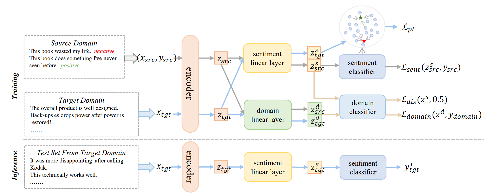

## Cross-Domain Sentiment Analysis via Disentangled Representation and Prototypical Learning

---

### Abstract

Most existing studies are dominant with adversarial learning methods and focus on learning domain-invariant sentiment representations in both the source and target domains. However, since sentiment-specific features are not explicitly decoupled, the model may confuse domain features with sentiment features, thus affecting its generalization ability on target domains. Unlike previous studies, in this paper, we tackle the CDSA task from the view of disentangled representation learning, which explicitly learns the disentangled representations of review, focusing in particular on sentiment and domain semantics. Specifically, we disentangle sentiment-specific and domain-specific features from the text representation of the review by two different linear transformations. Then, we introduce a straightforward disentangled loss to disallow the sentiment-specific feature to capture domain information. Moreover, we leverage target unlabeled data to improve the quality of the learned sentiment-specific features via prototypical learning.

### Overview

  

Figure 1 depicts the proposed framework that consists of three modules: 
1) text encoder module 
2) disentangled representation learning module
3) prototypical learning module I

### Main Results

  

---

### Follow the steps below to run the code:

1. download pre-trained model weights from [huggingface](https://huggingface.co/docs/transformers/model_doc/bert), and put it in `./pretrain_models` directory
2. download data according to references
4. install packages (see `requirements.txt`)
5. run `.run_prototype.py`
---
